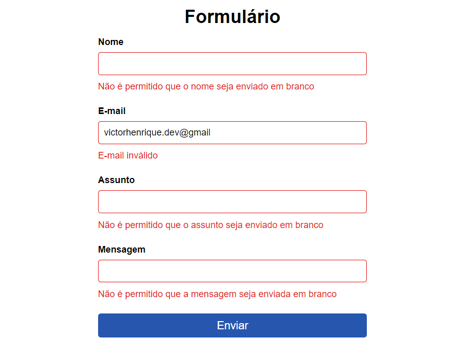

# form-js

## 🖥️ Projeto

Projeto form. É um projeto que contém um formulário com validações em JavaScript. Usamos também como forma de validação do formulário, uma expressão regular para validar o e-mail. 

## 🚀 Tecnologias

Esse projeto foi desenvolvido com as seguintes tecnologias:

- HTML
- CSS
- JavaScript
